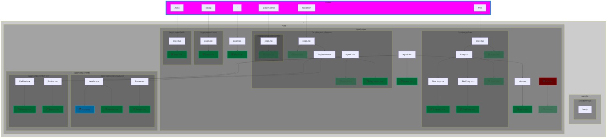

```mermaid
graph TB
  subgraph routes
    ROUTE____app__pages__tree__page.rux["/tree"]
    ROUTE____app__pages__pokemon__:id__page.rux["/pokemon/:id"]
    ROUTE____app__pages__pokemon__page.rux["/pokemon"]
    ROUTE____app__pages__about__page.rux["/about"]
    ROUTE____app__pages__hello__page.rux["/hello"]
    ROUTE____app__pages__page.rux["/"]
  end
  ROUTE____app__pages__tree__page.rux-->__app__pages__tree__page.rux
  ROUTE____app__pages__pokemon__:id__page.rux-->__app__pages__pokemon__:id__page.rux
  ROUTE____app__pages__pokemon__page.rux-->__app__pages__pokemon__page.rux
  ROUTE____app__pages__about__page.rux-->__app__pages__about__page.rux
  ROUTE____app__pages__hello__page.rux-->__app__pages__hello__page.rux
  ROUTE____app__pages__page.rux-->__app__pages__page.rux
  subgraph PATH__["/"]
    subgraph PATH__vendor["/vendor"]
      subgraph PATH__vendor__mayu["/vendor/mayu"]
        __vendor__mayu__live.js["live.js"]
      end
    end
    subgraph PATH__app["/app"]
      subgraph PATH__app__pages["/app/pages"]
        subgraph PATH__app__pages__tree["/app/pages/tree"]
          __app__pages__tree__Directory.css["fab:fa-css3 Directory.css&nbsp;"]
          __app__pages__tree__Directory.rux["Directory.rux"]
          __app__pages__tree__FileEntry.css["fab:fa-css3 FileEntry.css&nbsp;"]
          __app__pages__tree__FileEntry.rux["FileEntry.rux"]
          __app__pages__tree__Entry.css["fab:fa-css3 Entry.css&nbsp;"]
          __app__pages__tree__Entry.rux["Entry.rux"]
          __app__pages__tree__page.css["fab:fa-css3 page.css&nbsp;"]
          __app__pages__tree__page.rux["page.rux"]
        end
        subgraph PATH__app__pages__pokemon["/app/pages/pokemon"]
          subgraph PATH__app__pages__pokemon__:id["/app/pages/pokemon/:id"]
            __app__pages__pokemon__:id__page.css["fab:fa-css3 page.css&nbsp;"]
            __app__pages__pokemon__:id__page.rux["page.rux"]
          end
          __app__pages__pokemon__layout.css["fab:fa-css3 layout.css&nbsp;"]
          __app__pages__pokemon__layout.rux["layout.rux"]
          __app__pages__pokemon__Pagination.css["fab:fa-css3 Pagination.css&nbsp;"]
          __app__pages__pokemon__Pagination.rux["Pagination.rux"]
          __app__pages__pokemon__page.css["fab:fa-css3 page.css&nbsp;"]
          __app__pages__pokemon__page.rux["page.rux"]
        end
        subgraph PATH__app__pages__about["/app/pages/about"]
          __app__pages__about__page.css["fab:fa-css3 page.css&nbsp;"]
          __app__pages__about__page.rux["page.rux"]
        end
        subgraph PATH__app__pages__hello["/app/pages/hello"]
          __app__pages__hello__page.css["fab:fa-css3 page.css&nbsp;"]
          __app__pages__hello__page.rux["page.rux"]
        end
        __app__pages__Intro.css["fab:fa-css3 Intro.css&nbsp;"]
        __app__pages__Intro.rux["Intro.rux"]
        __app__pages__layout.css["fab:fa-css3 layout.css&nbsp;"]
        __app__pages__layout.rux["layout.rux"]
        __app__pages__page.css["fab:fa-css3 page.css&nbsp;"]
        __app__pages__page.rux["page.rux"]
        __app__pages__404.css["fab:fa-css3 404.css&nbsp;"]
        __app__pages__404.rb["fa:fa-gem 404.rb&nbsp;"]
      end
      subgraph PATH__app__components["/app/components"]
        subgraph PATH__app__components__Layout["/app/components/Layout"]
          __app__components__Layout__logo.png["fa:fa-image logo.png&nbsp;"]
          __app__components__Layout__Header.css["fab:fa-css3 Header.css&nbsp;"]
          __app__components__Layout__Header.rux["Header.rux"]
          __app__components__Layout__Footer.css["fab:fa-css3 Footer.css&nbsp;"]
          __app__components__Layout__Footer.rux["Footer.rux"]
        end
        subgraph PATH__app__components__Form["/app/components/Form"]
          __app__components__Form__Fieldset.css["fab:fa-css3 Fieldset.css&nbsp;"]
          __app__components__Form__Fieldset.rux["Fieldset.rux"]
          __app__components__Form__Button.css["fab:fa-css3 Button.css&nbsp;"]
          __app__components__Form__Button.rux["Button.rux"]
        end
      end
    end
  end
  __app__pages__Intro.rux-->__app__pages__Intro.css
  __app__components__Layout__Header.rux-->__app__components__Layout__logo.png
  __app__components__Layout__Header.rux-->__app__components__Layout__Header.css
  __app__components__Layout__Footer.rux-->__app__components__Layout__Footer.css
  __app__pages__layout.rux-->__app__pages__Intro.rux
  __app__pages__layout.rux-->__app__components__Layout__Header.rux
  __app__pages__layout.rux-->__app__components__Layout__Footer.rux
  __app__pages__layout.rux-->__app__pages__layout.css
  __app__pages__page.rux-->__app__pages__page.css
  __app__pages__tree__Directory.rux-->__app__pages__tree__Directory.css
  __app__pages__tree__FileEntry.rux-->__app__pages__tree__FileEntry.css
  __app__pages__tree__Entry.rux-->__app__pages__tree__Directory.rux
  __app__pages__tree__Entry.rux-->__app__pages__tree__FileEntry.rux
  __app__pages__tree__Entry.rux-->__app__pages__tree__Entry.css
  __app__pages__tree__page.rux-->__app__pages__tree__Entry.rux
  __app__pages__tree__page.rux-->__app__pages__tree__page.css
  __app__pages__pokemon__layout.rux-->__app__pages__pokemon__layout.css
  __app__components__Form__Fieldset.rux-->__app__components__Form__Fieldset.css
  __app__components__Form__Button.rux-->__app__components__Form__Button.css
  __app__pages__pokemon__Pagination.rux-->__app__components__Form__Fieldset.rux
  __app__pages__pokemon__Pagination.rux-->__app__components__Form__Button.rux
  __app__pages__pokemon__Pagination.rux-->__app__pages__pokemon__Pagination.css
  __app__pages__pokemon__page.rux-->__app__pages__pokemon__Pagination.rux
  __app__pages__pokemon__page.rux-->__app__pages__pokemon__page.css
  __app__pages__pokemon__:id__page.rux-->__app__pages__pokemon__:id__page.css
  __app__pages__about__page.rux-->__app__pages__about__page.css
  __app__pages__hello__page.rux-->__app__pages__hello__page.css
  __app__pages__404.rb-->__app__pages__404.css
  class __app__pages__Intro.css CSS
  class __app__components__Layout__logo.png Image
  class __app__components__Layout__Header.css CSS
  class __app__components__Layout__Footer.css CSS
  class __app__pages__layout.css CSS
  class __app__pages__page.css CSS
  class __app__pages__tree__Directory.css CSS
  class __app__pages__tree__FileEntry.css CSS
  class __app__pages__tree__Entry.css NonExistant
  class __app__pages__tree__Entry.css CSS
  class __app__pages__tree__page.css NonExistant
  class __app__pages__tree__page.css CSS
  class __app__pages__pokemon__layout.css NonExistant
  class __app__pages__pokemon__layout.css CSS
  class __app__components__Form__Fieldset.css CSS
  class __app__components__Form__Button.css CSS
  class __app__pages__pokemon__Pagination.css CSS
  class __app__pages__pokemon__page.css NonExistant
  class __app__pages__pokemon__page.css CSS
  class __app__pages__pokemon__:id__page.css NonExistant
  class __app__pages__pokemon__:id__page.css CSS
  class __app__pages__about__page.css CSS
  class __app__pages__hello__page.css CSS
  class __app__pages__404.css NonExistant
  class __app__pages__404.css CSS
  class __app__pages__404.rb Ruby
  style routes stroke:#09c,stroke-width:5,fill:#f0f;
  classDef cluster fill:#0003;
  classDef Ruby fill:#600,stroke:#900,stroke-width:3px;
  classDef Image fill:#069,stroke:#09c,stroke-width:3px;
  classDef CSS fill:#063,stroke:#096,stroke-width:3px;
  classDef NonExistant opacity:50%,stroke-dasharray:5px;
  linkStyle default fill:transparent,opacity:50%;
```
